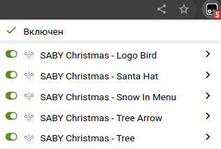
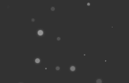
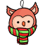

## Набор произвольных скриптов

> !!! Для работы сначала нужно [установить Tampermonkey](https://www.tampermonkey.net/), а затем устанавливать скрипты. 
> После установки списком включенных дополнений можно управлять из настроек плагина Tampermonkey в браузере.

#### Новогодняя тема

1.  Елочка под меню. _[установить](https://github.com/saby-customizer/user-script/raw/main/christmas-tree.user.js)_

2.  Елочки вместо стрелок `>` в меню. _[установить](https://github.com/saby-customizer/user-script/raw/main/christmas-tree-arrow.user.js)_

    

3.  Снегопад в меню. _[установить](https://github.com/saby-customizer/user-script/raw/main/christmas-snow-in-menu.user.js)_

4.  Птица в логотип. _[установить](https://github.com/saby-customizer/user-script/raw/main/christmas-logo-bird.user.js)_

 

5.  Шляпа Санты. _[установить](https://github.com/saby-customizer/user-script/raw/main/christmas-santa-hat.user.js)_

